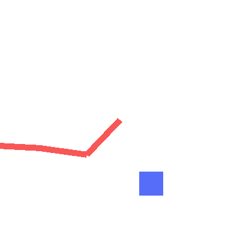
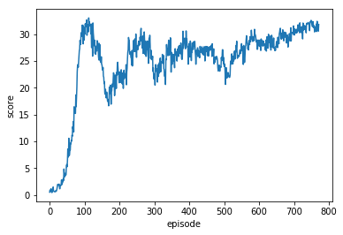
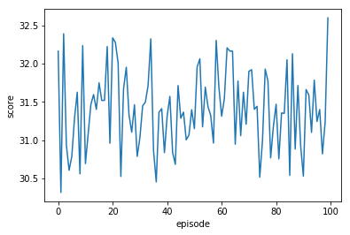

- [Project Continuous Control](#Project-Continuous-Control)
- [1. Introduction](#1-Introduction)
    - [1.1 Background](#11-Background)
    - [1.2 Distributed Training](#12-Distributed-Training)
    - [1.3 Solving the Environment](#13-Solving-the-Environment)
    - [1.3 Download environment](#13-Download-environment)
- [2. Project Walk-through](#2-Project-Walk-through)
    - [2.1 Dummy test with 2D Arm env](#21-Dummy-test-with-2D-Arm-env)
        - [Motivation](#Motivation)
        - [Setup](#Setup)
        - [Observation](#Observation)
        - [Replay](#Replay)
        - [Some Thinking](#Some-Thinking)
    - [2.2 Implementation of DDPG to solve Unity Reacher](#22-Implementation-of-DDPG-to-solve-Unity-Reacher)
        - [Setup](#Setup-1)
        - [Observation](#Observation-1)
        - [Training Log](#Training-Log)
        - [Testing Log](#Testing-Log)
        - [Replay](#Replay-1)
- [Other RL Works](#Other-RL-Works)

# Project Continuous Control

# 1. Introduction
### 1.1 Background
For this project, we will build agent to solve the modified [Reacher](https://github.com/Unity-Technologies/ml-agents/blob/master/docs/Learning-Environment-Examples.md#reacher) environment.


In this environment, a double-jointed arm can move to target locations. A reward of +0.1 is provided for each step that the agent's hand is in the goal location. Thus, the goal of your agent is to maintain its position at the target location for as many time steps as possible.

> The observation space consists of 33 variables corresponding to position, rotation, velocity, and angular velocities of the arm. Each action is a vector with four numbers, corresponding to torque applicable to two joints. Every entry in the action vector should be a number between -1 and 1.

Above are quote from internet, I can't find the exactly definition of the observation space and action space. Unluckily, it does NOT matter for the training. :-( So we can continue.

If anybody found the definition, please notify me. Really thanks :-)

### 1.2 Distributed Training

The environment produce 20 parallel agents to help collection data faster.
**BUT** not really distributed **training** in this repository, I only implement a DDPG with distributed **sampling**. 

### 1.3 Solving the Environment

The environment is considered solved, when the average (over 100 episodes) of those average scores is at least +30. 

### 1.3 Download environment

1. Download the environment from one of the links below.  You need only select the environment that matches your operating system:

    - **_Version 2: Twenty (20) Agents_**
        - Linux: [click here](https://s3-us-west-1.amazonaws.com/udacity-drlnd/P2/Reacher/Reacher_Linux.zip)
        - Mac OSX: [click here](https://s3-us-west-1.amazonaws.com/udacity-drlnd/P2/Reacher/Reacher.app.zip)
        - Windows (32-bit): [click here](https://s3-us-west-1.amazonaws.com/udacity-drlnd/P2/Reacher/Reacher_Windows_x86.zip)
        - Windows (64-bit): [click here](https://s3-us-west-1.amazonaws.com/udacity-drlnd/P2/Reacher/Reacher_Windows_x86_64.zip)

2. Place the file in the root of this repository

# 2. Project Walk-through
This project was solve by DDPG with batch sampling from 20 agents.
### 2.1 Dummy test with 2D Arm env
##### Motivation
* I built a 2D n-bar arm environment to test my algorithms.
  * My implementation is based on the orginal 2D 2-bar arm program from Morvan Zhou'[post](https://github.com/MorvanZhou/train-robot-arm-from-scratch)
  * I extended it to n-bars arm system, and add some utility functions, such as frame image collector, and GIF export.
* this 2D arm is similar but **not the same** with Unity Reacher
  * 2D arm can sense both ego parameters and target ball's distance from states.
  * Unity Reacher can only sense ego parameters **as claimed** from state.
    * I can't find a good documented definition for thie Reacher Env.
    * It is a motivation that I made the 2D arm env, which I know clearly about the env parameters.
  * So the two 2D n-bar arm learns to **track** the target ball.
  * Unity Reacher learns **a gesture**, e.g. rotate with a gesture with some constant movement pattern.
  * Tracking task from 2D n-bar arm has more straightforward rewards.
  * Gesture learning task has a more indirect/sparse reward.
  * The reward system is critical for RL models.
  * The tracking task is easier in my opinion.
* an example animation of training 3-bars arm


* an example animation of results


##### Setup
* With parameters
```python
env = ArmEnv(n_bar=3, bar_length=80)
agent = DDPG(state_size=env.state_size,
             action_size=env.action_size,
             lr_actor=0.001,
             lr_critic=0.001,
             update_every=10,
             gamma=0.9,
             tau=0.01,
             memory_size=30000,
             batch_size=32)
```
##### Observation
* The tracking task from 2D n-bar arm began to converge with about 20-50 trajectories averagely.
* and converged well with about 500 trajectories averagely.

##### Replay
* dependency: pyglet, imageio (optional) 
```
python continuous_control_2d.py
```
##### Some Thinking
  * for simple task, we could set a large learning rate to accelerate training
  * hard copy between local/target network can NOT be too frequent, we need to update local network at least e.g. 5-10 times, then copy to target network.
  * my intuitive understanding is that we update target network for every 10 steps of local network can reduce the bias error.

### 2.2 Implementation of DDPG to solve Unity Reacher
* After solved 2D arm system, the Reacher environment is similar, but with a much large solution space to explore.
* The agent need to find a certain constant dynamic gesture with random exploration.
* Without sensing ability, both reward and states are a bit implicit.
* since the solution space is much hard, we can encounter gradient explode/vanish more probably.
  * we can either clip the gradient
  ```python
  self.critic_optimizer.zero_grad()
  critic_loss.backward()
  torch.nn.utils.clip_grad_norm(self.critic_local.parameters(), 1)
  self.critic_optimizer.step()
  ```
  * or add batchnorm between the layer
  * my intuitive thinking. clip the critic network is enough, since actor network take output of critic network as baseline.
  * In this repository, I used BN solution.

##### Setup
* With parameters
```python
agent = DDPG(state_size=33,
                action_size=4,
                sample_batch_size=20,
                lr_actor=0.0001,
                lr_critic=0.0001,
                update_every=10,
                gamma=0.99,
                tau=0.01,
                memory_size=int(1e6),
                batch_size=128)
```
* I used a large memory size, to save almost recent 50 episodes, since I didn't implement Prioritized Experience Replay similar algorithms. For this task this lazy solution is reasonable, sine the target gesture do not change, the later experience is guaranteed better than previous'. When we collect the most recent trajectories, we are indeed improve the quality of the learning experience.
 
##### Observation
* converged well from about 20000 trajectories base on lucky.

##### Training Log


##### Testing Log


##### Replay
```
python continuous_control.py
```
# Other RL Works
* [unity banana navigation](https://github.com/masszhou/unity_banana_navigation)